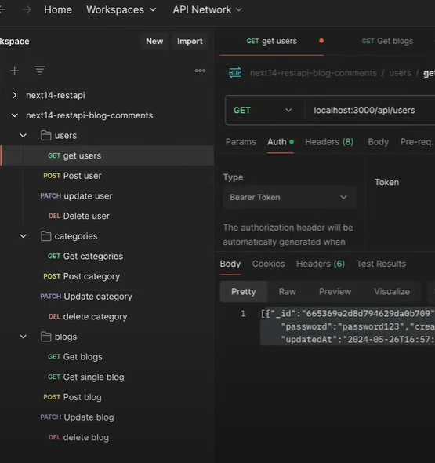

# NextJS Blog with MongoDB

A simple blog application built with Next.js 13+ (App Router), using MongoDB for data storage and featuring blog posts, user management, and categories.

## Features

- Blog post creation, reading, updating, and deletion
- User authentication and authorization
- Category management
- Responsive design with Tailwind CSS

## Tech Stack

- Next.js 14+ (App Router)
- MongoDB
- Mongoose ORM

## Demo

## Getting Started

1. Clone the repository
2. Install dependencies: `npm install`
3. Set up environment variables (see `.env.example`)
4. Run the development server: `npm run dev`

## API Routes

- `/api/posts`: Blog post operations
- `/api/users`: User management
- `/api/categories`: Category operations

## Contributing

Contributions are welcome! Please feel free to submit a Pull Request.

## License

This project is licensed under the MIT License.
